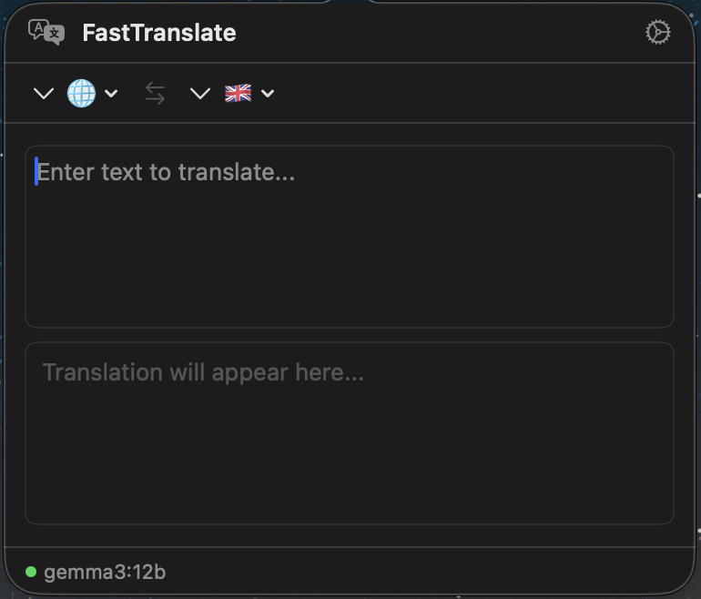
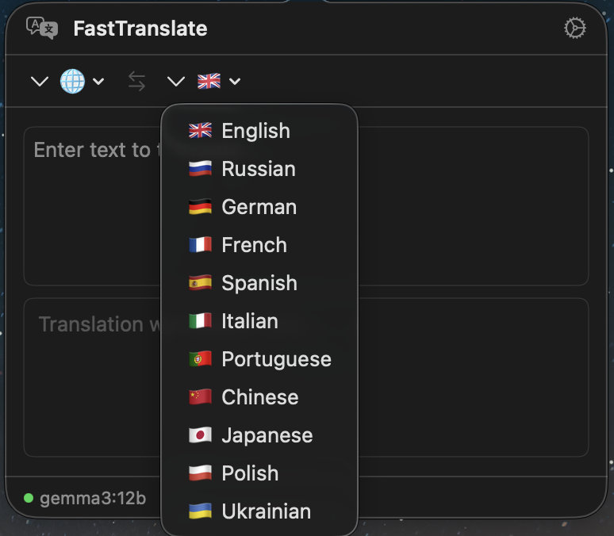

<p align="center">
  
</p>

<h1 align="center">FastTranslate</h1>

<p align="center">
  A lightweight macOS menu bar translator powered by local LLM models via <a href="https://ollama.com">Ollama</a>.<br>
  Private, fast, no cloud - your text never leaves your machine.
</p>

<p align="center">
  <a href="https://buymeacoffee.com/ril10"></a>
  
  
  
</p>

---

## Features

- **Menu bar app** - lives in your status bar, no Dock icon
- **Local LLM translation** - uses Ollama models (Gemma, LLaMA, Qwen, etc.)
- **Streaming output** - see translation appear token by token in real-time
- **Auto-translate** - translation starts automatically as you type or paste text
- **Inline translation (Cmd+Shift+T)** - select text anywhere, press the hotkey, get a floating glass panel with translation right at your cursor
- **12 languages** - English, Russian, German, French, Spanish, Italian, Portuguese, Chinese, Japanese, Polish, Ukrainian + auto-detect
- **Launch at login** - starts automatically with macOS
- **Dark/Light mode** - custom menu bar icons for both themes
- **Privacy first** - zero network calls to external services, everything runs locally

## Screenshots

<p align="center">
  
  &nbsp;&nbsp;
  
</p>

## Requirements

- macOS 13.0 (Ventura) or later
- [Ollama](https://ollama.com) installed and running locally

## Installation

### Download

1. Go to [Releases](https://github.com/ril10/FastTranslate/releases/latest)
2. Download `FastTranslate-v*.zip`
3. Unzip and drag `FastTranslate.app` to your **Applications** folder
4. On first launch macOS will block the app. Go to **System Settings > Privacy & Security**, scroll down and click **Open Anyway**

### From Source

```bash
git clone https://github.com/ril10/FastTranslate.git
cd FastTranslate
open FastTranslate.xcodeproj
```

Build and run with Xcode (Cmd+R).

### Setup Ollama

1. Install Ollama from [ollama.com](https://ollama.com)
2. Pull a model (we recommend `gemma3:12b`, but you can use any Ollama model you like):
   ```bash
   ollama pull gemma3:12b
   ```
3. Make sure Ollama is running:
   ```bash
   ollama serve
   ```

## Usage

### Menu Bar Translator

Click the FastTranslate icon in the menu bar to open the translation popover. Type or paste text - translation starts automatically.

### Inline Translation

1. Select any text in any application
2. Press **Cmd+Shift+T**
3. A floating glass panel appears near your cursor with the translation
4. Click **Copy** or click outside to dismiss

> **Note:** Inline translation requires Accessibility permission. macOS will prompt you to grant access in System Settings > Privacy & Security > Accessibility.

### Settings

- **Server URL** - Ollama server address (default: `http://localhost:11434`)
- **Model** - choose from locally available Ollama models
- **Source/Target language** - default language pair
- **Launch at login** - auto-start with macOS
- **Inline translation** - enable/disable the Cmd+Shift+T hotkey

## Architecture

```
Sources/
├── App/                  # App entry point, AppDelegate, MenuBarController
├── Models/               # Language, AppSettings, Ollama DTOs
├── Views/                # TranslateView, SettingsView, FloatingTranslationPanel
├── ViewModels/           # TranslationViewModel, SettingsViewModel
└── Services/             # TranslationProvider protocol, OllamaProvider, GlobalHotkeyService
```

- **Input/Output pattern** - ViewModels use `send(_ input:)` for events and `@Published` properties for state
- **TranslationProvider protocol** - abstraction over LLM backends, easy to add new providers
- **AsyncThrowingStream** - streaming translation with proper cancellation
- **SwiftUI + AppKit** - SwiftUI views hosted in NSPopover and NSPanel

## Supported Languages

| Language | Code | Flag |
|----------|------|------|
| Auto-detect | auto | :globe_with_meridians: |
| English | en | :gb: |
| Russian | ru | :ru: |
| German | de | :de: |
| French | fr | :fr: |
| Spanish | es | :es: |
| Italian | it | :it: |
| Portuguese | pt | :portugal: |
| Chinese | zh | :cn: |
| Japanese | ja | :jp: |
| Polish | pl | :poland: |
| Ukrainian | uk | :ukraine: |

## Contributing

Contributions are welcome! Feel free to open issues and pull requests.

1. Fork the repository
2. Create your feature branch (`git checkout -b feature/amazing-feature`)
3. Commit your changes
4. Push to the branch
5. Open a Pull Request

## Support

If you find FastTranslate useful, consider buying me a coffee:

[](https://buymeacoffee.com/ril10)

## License

This project is licensed under the MIT License - see the [LICENSE](LICENSE) file for details.
